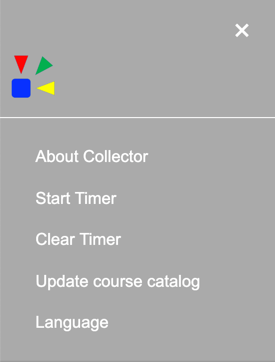
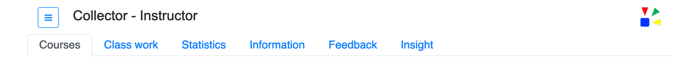
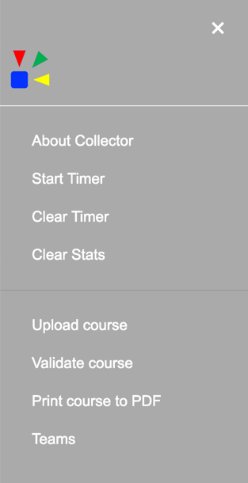
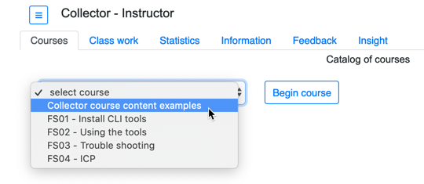

# Collector
---

Collector is an application developed to assist with enablement and training.  One or more courses can be taught or presented via the user interface. The user interface is browser based and provides two personas, instructor and student.  A series of tabs categorize the actions the user is able to perform.  The student and instructor personas are provided with a core set of common capabilties.  While the instructor persona is provided with additional capabilties that assist with course creation, validation, printing, and usage insights of student interaction. 

--
### Student and Instuctor tabs and menus

The following section provides brief descriptions an images of the student and instructor tabs and menu options.  

--
##### Student tabs

The student is provided with the following tabs:

1. __Courses__ - A drop-down menu of available courses with a 'Begin Course' button.
2. __Class work__ - This is where the course content is presented.  
3. __Statistics__ - Provides a tracking of the current completed course work.
4. __Information__ - Information that may be helpful in the completion of the course is provided on this tab.
5. __Feedback__ - Provides the ability to submit feedback.  

--

##### Student menu

The instructor is provided with the following additional menu options:

1. __About Collector__ - About information for Collector.
2. __Start Timer__ - Set and start a timer.
3. __Clear Timer__ - Clear and reset the timer display information.
4. __Clear Stats__ - Reset the information that is shown on the Statistics tab.

--

##### Instructor tabs

The instructor is provided with the same tabs as the student plus the __Insights__ tab.  This tab provides a graphical view of the student interactions with each course.

--

##### Instructor menu

The instructor is provided with the same menu options as the student plus the following additional options:

1. __Upload course__ - Add a course to the existing course catalog instance via a drag-n-drop interface.
2. __Validate course__ - Validate the course to help ensure it will be processed properly within the instruction process of Collector.
3. __Print course to PDF__ - Create a PDF file of the course content.
4. __Teams__ - View the defined team (or) students names and colors that are used when displaying statistics.

----

### User interface tabs

#### Courses tab

The initial screen once started will display the __Courses__ tab.  From this tab select the drop down that contains the list of available courses.  

> Refer the the __Configuration__ section of this documentation for information on making courses available in this drop down menu.

 

Once a course is selected, if defined, a brief description of the course is shown below the drop down list.  This description will contain the content as defined by the course author. To start the course press the _Begin Course_ button .  

Example of selected course with description shown. 

> Refer the the __Course authoring__ section of this documentation for detailed information on creating courses.

Once the course has been started the __Class work__ tab will be shown.  This tab will also have adrop down menu of the available work to be performed for this course.  This drop down is dynamic and will change based on the course selected.  The content for the work items are defined by the course author.  

#### Class work tab - course work UI

The course author defines what content will be shown.  As each work item is selected the UI will change based on the course content.  These changes includes the number of sections, number of buttons, an if a _Complete_ button is defined.  When a number and/or capital letter is referenced in the following documentation refer to the matching _red_ numnber or letter in the image below.

* When the work item is selected, number 1, the pale blue section, letter A, will be shown.  This base section is required and will always be shown when a work item is selected. 

* Buttons number 2 and 3 and setions B and C are optional.

* When button number 2 is defined and it is pressed the pale green section, letter B, will be shown.

* When button number 3 is defined and it is pressed the pale orange section, letter C, will be shown.

* Letter D, the complete button, is optional and can be defined to display in one or more of the lettered sections.  If defined, when pressed this button records the completion of the work item.  The completion information is tracked on the __Statistics__ tab.

#### Statistics tab

The statistics tab will display the progress of the course work.  The number of _red circle_ and _green checkmarks_ is dynamic.  The number of red circle is defined by the course author when creating the course content.  The number of _green checkmarks_ shown is controlled by the number of completed work items.  Completed work items can be created by defining the _complete_ button or by using the auto complete feature.  

> Refer to the Auto complete section of the documentation for details on how to use this feature.

  

## Maintainer

IBM ICP CoC
 

## License

Copyright &#x00A9; 2019 IBM®

 

Permission is hereby granted, free of charge, to any person obtaining a copy of this software and associated documentation files (the
"Software"), to deal in the Software without restriction, including without limitation the rights to use, copy, modify, merge, publish,
distribute, sublicense, and/or sell copies of the Software, and to permit persons to whom the Software is furnished to do so, subject to
the following conditions:

 

The above copyright notice and this permission notice shall be included in all copies or substantial portions of the Software.

 

THE SOFTWARE IS PROVIDED "AS IS", WITHOUT WARRANTY OF ANY KIND, EXPRESS OR IMPLIED, INCLUDING BUT NOT LIMITED TO THE WARRANTIES OF
MERCHANTABILITY, FITNESS FOR A PARTICULAR PURPOSE AND NONINFRINGEMENT. IN NO EVENT SHALL THE AUTHORS OR COPYRIGHT HOLDERS BE
LIABLE FOR ANY CLAIM, DAMAGES OR OTHER LIABILITY, WHETHER IN AN ACTION OF CONTRACT, TORT OR OTHERWISE, ARISING FROM, OUT OF OR IN CONNECTION
WITH THE SOFTWARE OR THE USE OR OTHER DEALINGS IN THE SOFTWARE.

