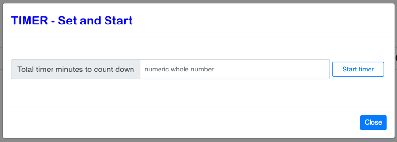
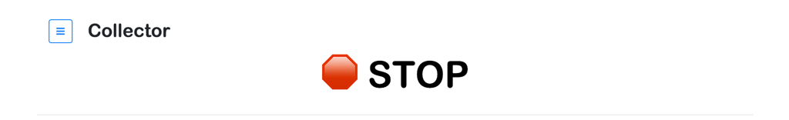
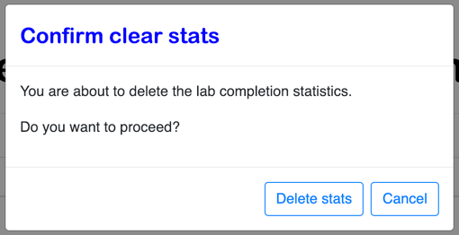

# Collector
---

Collector is an application developed to assist with enablement and training.  One or more courses can be taught or presented via the user interface. The user interface is browser based and provides two personas, instructor and student.  A series of tabs categorize the actions the user is able to perform.  The student and instructor personas are provided with a core set of common capabilties.  While the instructor persona is provided with additional capabilties that assist with course creation, validation, printing, and usage insights of student interaction. 

--
### Student and Instuctor tabs and menus

The following section provides brief descriptions an images of the instructor and student tabs and menus options.  

--
##### Student tabs

The student is provided with the following tabs:

1. __Courses__ - A drop-down menu of available courses with a 'Begin Course' button.
2. __Class work__ - This is where the course content is presented.  
3. __Statistics__ - Provides a tracking of the current completed course work.
4. __Information__ - Information that may be helpful in the completion of the course is provided on this tab.
5. __Feedback__ - Provides the ability to submit feedback.  

--

##### Student menu

The instructor is provided with the following additional menu options:

1. __About Collector__ - About information for Collector.
2. __Start Timer__ - Set and start a timer.
3. __Clear Timer__ - Clear and reset the timer display information.
4. __Clear Stats__ - Reset the information that is shown on the Statistics tab.

--

##### Instructor tabs

The instructor is provided with the same tabs as the student plus the __Insights__ tab.  This tab provides a graphical view of the student interactions with each course.

--

##### Instructor menu

The instructor is provided with the same menu options as the student plus the following additional options:

1. __Upload course__ - Add a course to the existing course catalog instance via a drag-n-drop interface.
2. __Validate course__ - Validate the course to help ensure it will be processed properly within the instruction process of Collector.
3. __Print course to PDF__ - Create a PDF file of the course content.
4. __Teams__ - View the defined team (or) students names and colors that are used when displaying statistics.

#### Problem Determination and Troubleshooting

The session is part of the larger IBM® Cloud Fast Start 2.0 at locations in North America, Europe, and Asia Pacific.

Each team is assigned a color. This color is also used for K8s namespace when needed.
The dashboard uses the color assigned each team to track lab progress.  The use of the colors should make it very easy for teams to track their progress.  

> The interface will dynamically add the team/namespace/color row once the first lab is completed.  After the first lab is completed each green checkmark will be added as the appropriate labs is completed.
 
There is also count down timer that show displays the remaining time left for the labs.

#### Set and start timer

The time is set by selecting the navigation button (box with three bars) in the uppper left of the screen.  Select option <b>Start Timer</b> to begin.

Once selected a modal screen is presented.  Enter the number of minutes for the timer to run and press the <b>Start timer</b> button.

When the timer has completed a Stop message will be displayed.

#### Clear stats

Clear the timer by selecting the navigation button (box with three bars) in the uppper left of the screen.  Select option <b>Clear stats</b> to begin.

Once selected a modal screen is presented.  Press the <b>Delete stats</b> button to clear the stats.

  

## Maintainer

IBM ICP CoC
 

## License

Copyright &#x00A9; 2019 IBM®

 

Permission is hereby granted, free of charge, to any person obtaining a copy of this software and associated documentation files (the
"Software"), to deal in the Software without restriction, including without limitation the rights to use, copy, modify, merge, publish,
distribute, sublicense, and/or sell copies of the Software, and to permit persons to whom the Software is furnished to do so, subject to
the following conditions:

 

The above copyright notice and this permission notice shall be included in all copies or substantial portions of the Software.

 

THE SOFTWARE IS PROVIDED "AS IS", WITHOUT WARRANTY OF ANY KIND, EXPRESS OR IMPLIED, INCLUDING BUT NOT LIMITED TO THE WARRANTIES OF
MERCHANTABILITY, FITNESS FOR A PARTICULAR PURPOSE AND NONINFRINGEMENT. IN NO EVENT SHALL THE AUTHORS OR COPYRIGHT HOLDERS BE
LIABLE FOR ANY CLAIM, DAMAGES OR OTHER LIABILITY, WHETHER IN AN ACTION OF CONTRACT, TORT OR OTHERWISE, ARISING FROM, OUT OF OR IN CONNECTION
WITH THE SOFTWARE OR THE USE OR OTHER DEALINGS IN THE SOFTWARE.

