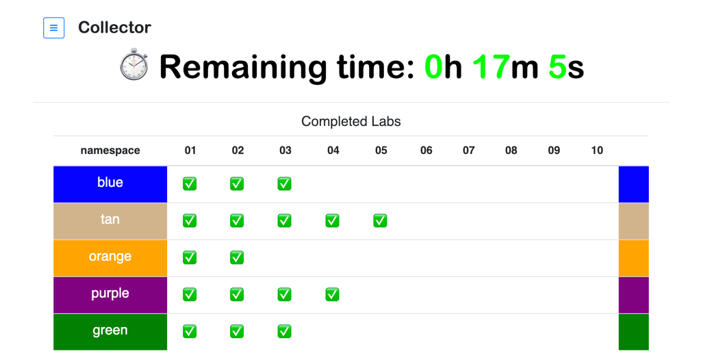

# Collectorh
---

Collector is an application that is used to provide interactive tracking for the labs being performed for the session titled:   

#### Problem Determination and Troubleshooting

The session is part of the larger IBM® Cloud Fast Start 2.0 at locations in North America, Europe, and Asia Pacific.

Each team is assigned a color. This color is also used for K8s namespace when needed.
The dashboard uses the color assigned each team to track lab progress.  The use of the colors should make it very easy for teams to track their progress.  

The interface will dynamically add the team/namespace/color row once the first lab is completed.  After the first lab is completed each green checkmark will be added as the appropriate labs is completed.
 
There is also count down timer that show displays the remaining time left for the labs.

  

## Maintainer

IBM ICP CoC

https://github.com/IBM-ICP-CoC/collector

## License

Copyright 2019 IBM® ICP COC Team

Permission is hereby granted, free of charge, to any person obtaining a copy of this software and associated documentation files (the
"Software"), to deal in the Software without restriction, including without limitation the rights to use, copy, modify, merge, publish,
distribute, sublicense, and/or sell copies of the Software, and to permit persons to whom the Software is furnished to do so, subject to
the following conditions:

The above copyright notice and this permission notice shall beincluded in all copies or substantial portions of the Software.

THE SOFTWARE IS PROVIDED "AS IS", WITHOUT WARRANTY OF ANY KIND, EXPRESS OR IMPLIED, INCLUDING BUT NOT LIMITED TO THE WARRANTIES OF
MERCHANTABILITY, FITNESS FOR A PARTICULAR PURPOSE AND NONINFRINGEMENT. IN NO EVENT SHALL THE AUTHORS OR COPYRIGHT HOLDERS BE
LIABLE FOR ANY CLAIM, DAMAGES OR OTHER LIABILITY, WHETHER IN AN ACTION OF CONTRACT, TORT OR OTHERWISE, ARISING FROM, OUT OF OR IN CONNECTION
WITH THE SOFTWARE OR THE USE OR OTHER DEALINGS IN THE SOFTWARE.
